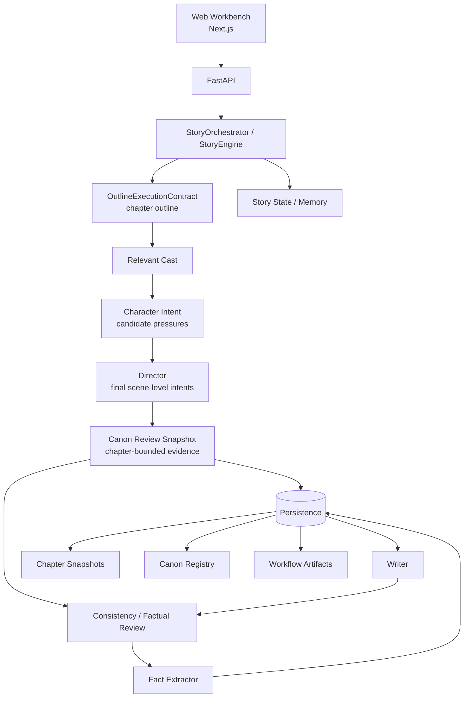

# NovelFlow Engine

[](https://github.com/zj3983/novelflow-engine/actions)
[](LICENSE)


**面向长篇小说持续创作的有状态 AI 生成引擎。**

NovelFlow Engine 不只生成“下一章文本”，而是把章节规划、角色与世界状态、连续性检查、记忆压缩、章节重生成和可检查的工作流产物放进同一条持续演进的创作流水线。

> Stateful, continuously evolving long-form novel generation with inspectable planning, continuity and writing workflows.

[快速开始](#快速开始) · [核心能力](#核心能力) · [架构](#架构概览) · [项目状态](#项目状态) · [文档](#文档) · [贡献](#参与贡献)

---

## 为什么做 NovelFlow

普通的一次性文本生成很容易在长篇小说里出现角色设定漂移、世界规则遗忘、伏笔断裂、章节目标失焦等问题。

NovelFlow 的目标是把“写小说”建模成一个**持续维护状态的长期过程**：

- 每一章都基于当前故事状态和明确的章节规划继续推进。
- 角色、实体、世界状态和连续性信息可以被结构化保存和检查。
- 生成过程拆成多个职责清晰的模块，而不是把所有上下文塞进一个 Prompt。
- 重写旧章节时尽量从正确的历史快照恢复，而不是让后续内容反向污染旧章节。
- 中间产物可以落盘查看，方便定位生成失败、连续性问题和 Agent 行为。

## 核心能力

| 能力 | 说明 |
| --- | --- |
| **长篇状态管理** | 保存故事、角色、世界、章节与连续性状态，让生成跨章节持续演进。 |
| **章节合同与模块化 Agent** | 以 `OutlineExecutionContract` 固定章节要求，再由 Character Intent、Director、Canon Review Snapshot、Canon Entity Preflight、Writer、Review 和 Fact Extractor 分工协作。 |
| **章节规划与滚动细纲** | 在缺少目标章节细纲时，可按滚动窗口补齐后续章节规划，并保护人工修改内容。 |
| **Canon / 连续性约束** | 使用稳定实体注册表、chapter-bounded Canon Review Snapshot 和连续性 Delta 降低角色与设定漂移。 |
| **章节重生成与回滚** | 重写历史章节时从对应快照恢复，并标记受影响的后续章节。 |
| **可检查工作流** | Character Intent、Director、Writer、Fact Extractor 等阶段产物可持久化，失败时便于定位具体阶段。 |
| **Web 创作工作台** | 在浏览器中创建项目、生成章节、查看状态和连续性数据。 |
| **OpenAI-compatible 模型接入** | 通过可配置 endpoint / model 接入兼容 OpenAI API 形式的模型服务。 |
| **SQLite 持久化** | 默认提供适合本地与单用户部署的 SQLite 存储。 |
| **Docker Compose** | 可将 API、Web 与数据卷一起启动。 |

## 架构概览



章节生成的控制优先级是：`OutlineExecutionContract > Character Intent > Director staging > Writer performance`。
细纲合同决定本章必须发生的冲突、收益、代价、状态变化和章末钩子；Character Intent 只提供人物自己的局部压力，不是第二套剧情规划器。Director 编排并筛选这些压力，但不能改写上游合同；Writer 只消费 Director 最终保留的 scene-level character intents，raw Character proposals 不会直接进入 Writer。

主要代码边界：

| 路径 | 职责 |
| --- | --- |
| `packages/story_core/` | 小说状态、Agent、连续性、Canon、持久化和生成编排核心 |
| `apps/api/` | FastAPI 接口与运行时配置 |
| `apps/web/` | Next.js Web 创作工作台 |
| `plugins/` | 插件相关能力 |
| `docs/` | 架构、API、配置、部署和开发文档 |
| `tests/` | Python 测试与生成链路验证 |

## 快速开始

### 1. 环境要求

- Python **3.11+**
- Node.js / npm
- [uv](https://docs.astral.sh/uv/)
- 一个 OpenAI-compatible 模型服务

### 2. 获取代码并安装依赖

```bash
git clone https://github.com/zj3983/novelflow-engine.git
cd novelflow-engine

cp .env.example .env.local
uv sync --extra dev

cd apps/web
npm ci
cd ../..
```

Windows PowerShell 可以使用：

```powershell
Copy-Item .env.example .env.local
```

### 3. 配置模型

在 `.env.local` 中填写你的模型服务配置，例如：

```env
OPENAI_BASE_URL=https://your-openai-compatible-endpoint/v1
OPENAI_API_KEY=your-api-key
NOVEL_LLM_PROVIDER=openai
NOVEL_AUTOGROWTH_DEFAULT_MODEL=your-model
NOVEL_AUTOGROWTH_FAST_MODEL=your-fast-model
```

不要把真实 API Key 提交到 Git。

### 4. 启动 API

```bash
uv run uvicorn apps.api.main:app --host 127.0.0.1 --port 8000 --reload
```

### 5. 启动 Web

另开一个终端：

```bash
cd apps/web
npm run dev
```

打开：

```text
http://127.0.0.1:3000
```

API 默认地址：

```text
http://127.0.0.1:8000
```

### Docker Compose

如果希望 API、Web 和 SQLite 数据卷一起启动：

```bash
docker compose up --build
```

## 生成链路

当前模块化生成链路以可检查的阶段运行：

```text
章节细纲
   ↓
OutlineExecutionContract
   ↓
Relevant Cast / Character Intent
   ↓
Director
   ↓
Canon Review Snapshot
   ↓
Canon Entity Preflight
   ↓
Writer
   ↓
Consistency / Factual Review
   ↓
Fact Extractor
   ↓
候选章节 / 连续性状态 / 工作流产物
```

`OutlineExecutionContract` 会保留本章的 core conflict、gain、cost、state delta、planned hook、opening carry、payoff contract 和 must-not-write，避免细纲要求在 Director → Writer 链路中被压缩丢失。Character Intent 可以调查、保护、试探、抵抗、犹豫、沉默，或在低刺激时不行动，但不能替换合同的收益、代价、状态转移或 planned hook。

`canon-review-snapshot/v1` 是 Writer pipeline 在 Canon Entity Preflight 之前构建的只读、chapter-bounded factual review evidence，供后续 Consistency / Factual Review 使用，以避免历史重写被未来状态污染。Canon Entity Preflight 只处理 Director 要求的实体，为 Writer 准备 chapter-local entities；prepared entities 不会因为 preflight 就成为 established Canon facts。正文末段没有落地合同要求的 planned hook 时，会触发确定性的 `chapter.hook_not_landed` blocking gate；Writer 可以改变表达方式，但不能改变钩子实质。

运行产物会写入项目的 `.story-system/`，其中包括章节快照、Canon Registry、角色/实体卡、Review 数据和模块化 workflow artifacts：

```text
.story-system/workflow/<job_id>/
├── character-intent.json
├── director.json
├── writer.json
└── fact-extractor.json
```

历史项目的 `.webnovel/` 数据结构在迁移窗口内仍然可以被读取。详细迁移、重生成、Smoke 验收和 Rolling Outline 说明见 [开发与生成链路说明](docs/development-notes.md)。

## 项目状态

NovelFlow Engine 目前仍处于**快速开发阶段**，还没有承诺稳定的数据格式或稳定 API。

当前重点包括：

- 继续收敛模块化 Agent 生成链路。
- 提升长篇小说中的人物个性、剧情推进、伏笔与连续性质量。
- 完善插件化能力和 Agent 自动化框架。
- 继续改善 Web 创作工作台的可用性。
- 为未来更成熟的存储后端和部署方式保留演进空间。

如果你准备把它用于重要项目，请先备份数据，并优先在测试项目上验证升级和迁移。

## 测试

Python：

```bash
uv run pytest -q
```

Web：

```bash
cd apps/web
npm run build
npm run test:e2e
```

仓库使用 GitHub Actions 持续验证 Python 和 Web 代码。

## 文档

- [配置说明](docs/configuration.md)
- [API Reference](docs/api.md)
- [部署说明](docs/deployment.md)
- [架构说明](docs/architecture.md)
- [开发与生成链路说明](docs/development-notes.md)
- [Agent 自动化框架](docs/agent-automation-framework.md)
- [插件化 Roadmap](docs/pluginization-roadmap.md)
- [Codex 插件架构](docs/codex-plugin-architecture.md)

## Roadmap

下面是当前公开开发方向，不代表固定发布时间：

- [ ] 继续统一 legacy 与 modular 生成路径
- [ ] 提升 Director / Writer / Consistency 协作质量
- [ ] 完善长篇滚动规划与历史章节重生成体验
- [ ] 扩展插件化 Agent / Craft Module 能力
- [ ] 改善运行观测、失败诊断和工作流可视化
- [ ] 为多用户部署准备更成熟的数据库后端
- [ ] 补充稳定版本、升级指南与兼容性策略

欢迎通过 Issue 讨论优先级和具体设计。

## 参与贡献

欢迎 Bug 修复、测试、文档、性能优化、UI 改进和新的小说创作能力。

提交前请阅读：

- [CONTRIBUTING.md](CONTRIBUTING.md)
- [CODE_OF_CONDUCT.md](CODE_OF_CONDUCT.md)
- [SECURITY.md](SECURITY.md)

请不要在 Issue、PR 或日志中提交 API Key、Token、Cookie、真实用户小说内容或其他私人数据。

## 开源许可

NovelFlow Engine 源码和仓库文档采用 [Apache License 2.0](LICENSE)。

你可以在许可证允许的范围内使用、修改、分发和用于商业用途。第三方模型、API、云服务、数据集和其他外部依赖仍受各自许可证、服务条款和计费规则约束。

---

### English summary

NovelFlow Engine is an open-source, stateful engine for continuously evolving long-form novel generation. It combines planning, story state, continuity, modular agents, inspectable workflow artifacts, regeneration, and a browser-based workbench in one development stack.

For setup, architecture and contribution details, follow the links above.
