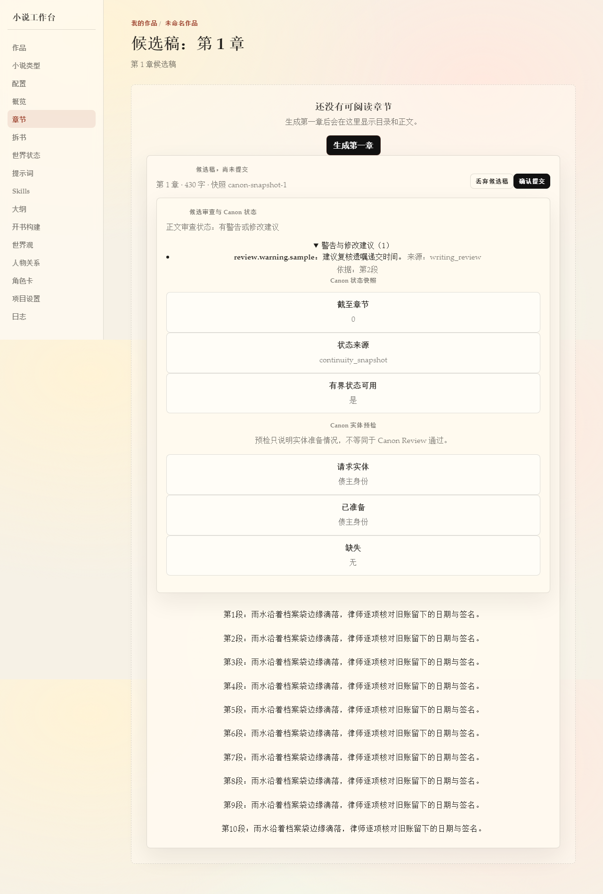

# First novel workbench journey

This guide follows the supported file-project flow from creation through the first cross-volume plan. The Opening Graph writes prose only as a pending candidate; a person must review and confirm each chapter before it becomes official prose or Canon state.

## Start locally

From the repository root, start the API:

```powershell
uv run uvicorn apps.api.main:app --host 127.0.0.1 --port 8000 --reload
```

In a second terminal, start the Web workbench:

```powershell
Set-Location apps/web
npm run dev
```

Open <http://127.0.0.1:3000>. The API runs at <http://127.0.0.1:8000>. Use a new synthetic project while validating this workflow. Generation actions use the project's configured runtime; acceptance tests inject fake generators and do not call an external provider.

## Click through the workflow

1. Open **作品** and choose **新建小说**. Select a novel type, provide a title and premise, then create the project.
2. On **开篇设定**, review and select an opening direction.
3. Open **开书构建** from the project navigation. Choose **启用完整开局图**, then **继续构建** until the formal Opening Graph has published the initial three-chapter window.
4. Choose **补齐首卷细纲任务**, then **继续构建** until the complete first-volume detail and execution handoff are published. Do not use the legacy Outline generation buttons for an Opening Graph project.
5. Open **正文** and choose **生成下一章**. The job leaves a pending candidate; it does not write an accepted chapter.
6. Read the full candidate and the recorded Canon/consistency review, then choose **确认提交** only when it is ready. A hard Canon blocker remains non-bypassable. Repeat generation and confirmation one chapter at a time through the confirmed volume boundary.
7. At the confirmed volume boundary, follow the page's **开书构建** link. Choose **扩展下一卷细纲任务**, then **继续构建** until the new complete volume is published.
8. Return to **正文** and generate and review the next-volume candidates in sequence.

## Page acceptance evidence

The Playwright journey covers project creation, Opening Graph planning, candidate generation and confirmation, and the next-volume handoff. Its browser API is stubbed with synthetic project state; backend fake-engine tests separately exercise the generation and confirmation routes. The image below is the synthetic candidate review page captured by that browser test.



## Safety and recovery

- Pending, discarded, or failed candidates do not advance the chapter or Canon state.
- Confirmation rechecks candidate authority and writes prose, state, Canon, and the receipt through the existing transaction.
- Opening Graph prose generation stays single-chapter and manually confirmed. Continuous generation and rewriting of accepted Opening prose are not supported by this flow.
- If planning inputs or graph revisions change, return to **开书构建**, resolve the reported conflict, and rebuild or synchronize before generating more prose.
- A failed generation job should be terminal and leave the candidate/project state available for retry; use the job log for its actionable error.

The default first volume may contain many chapters. Cross-volume extension is intentionally available only after every chapter in that volume has been confirmed.
