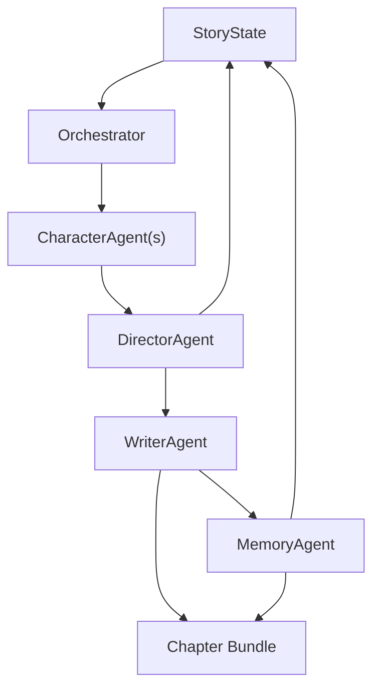

# 小说多 Agent 框架设计稿

## 1. 背景

当前项目已经完成了单引擎小说闭环：

- 角色行动提议
- 主冲突 / 次冲突裁决
- 章节正文生成
- 章节摘要压缩
- 下一章接力
- 回滚 / 分支 / 故事树

这些能力已经让系统可以连续产章，但它仍然本质上是“一个引擎里的模块化函数”，而不是真正的多 Agent 协作框架。

本设计稿的目标，是把现有小说引擎升级成一个更接近 MiroFish 思路的多 Agent 系统，让角色、导演、写作者、记忆管理各自成为独立 Agent，并支持新角色自然出现后被系统接纳或拒绝。

## 2. 目标

### 2.1 核心目标

- 角色可以作为独立 Agent 先提出本章行动倾向、目标变化和关系变化。
- Director Agent 可以在多个角色提案中裁决主冲突、副冲突、节奏和本章事件骨架。
- Writer Agent 只负责把导演裁决写成正文，不再承担裁决职责。
- Memory Agent 只负责把章节结果写回长期状态，不参与正文创作。
- 新角色可以在剧情中自然出现，但必须经过导演审批后才能进入长期角色库。
- 系统仍然保持“你给大纲，系统自动连载”的主体验，不把交互复杂度暴露给用户。

### 2.2 成功标准

- 每章生成前，至少有多个角色 Agent 的独立提案参与裁决。
- 新角色不是直接写死进 cast，而是先进入候选态，再由 Director Agent 决定是否正式接纳。
- 接纳后的新角色会自动获得基础状态、目标、关系和记忆。
- 章节输出仍然保持稳定的结构化结果：
  - 正文
  - 角色状态卡
  - 伏笔 / 回收清单
  - 下一章提纲
  - 结构化摘要
- 现有单引擎能力不被破坏，能够分阶段迁移。

## 3. 非目标

本设计稿不试图一次性解决所有高阶问题：

- 不追求一开始就做完全自治、完全不可控的多 Agent 生态。
- 不追求让每个角色都拥有完整独立世界模型和长上下文私域记忆。
- 不追求在第一版里做复杂的消息总线、分布式部署或跨机器 agent 协调。
- 不把 UI 先做成高度复杂的 Agent 编排控制台。

本设计只聚焦一件事：把“小说引擎”拆成职责明确的多 Agent 协作链，并让新角色接纳机制可控、可测试、可回滚。

## 4. 设计原则

- **导演主导**
  - 角色可以自由提案，但最终主线节奏和章节裁决由 Director Agent 统一收口。

- **角色自治，但不放飞**
  - 角色要有自主性，但只能在故事边界内活动。

- **新角色先候选，再入编**
  - 先允许剧情中出现，再决定是否进入长期 cast。

- **职责单一**
  - CharacterAgent 只提案。
  - DirectorAgent 只裁决。
  - WriterAgent 只写正文。
  - MemoryAgent 只回写状态。

- **可回滚**
  - 新角色接纳、驳回、冻结都必须支持回滚到章节快照。

## 5. 总体架构

推荐采用“导演主导版多 Agent 框架”：

1. **CharacterAgent**
   - 每个活跃角色独立生成本章行动提案。
   - 输出内容包括目标、情绪、冲突倾向、是否引入新角色。

2. **DirectorAgent**
   - 汇总所有角色提案。
   - 选择主冲突、副冲突、节奏、事件转折。
   - 决定新角色是否接纳进长期角色库。

3. **WriterAgent**
   - 基于导演裁决和结构化摘要生成章节正文。
   - 负责保持风格、节奏和上下文接力。

4. **MemoryAgent**
   - 抽取事实、关系变化、伏笔、未解线程和下一章接力点。
   - 回写到长期故事状态。

5. **Orchestrator**
   - 负责调度上述 Agent 的执行顺序。
   - 负责上下文打包、结果合并、失败重试和回滚。

### 架构图

## 6. 核心组件设计

### 6.1 CharacterAgent

**职责**

- 基于当前角色状态提出本章行动提案。
- 评估本章目标、情绪、关系、秘密和记忆。
- 可提出：
  - 行动意图
  - 新冲突倾向
  - 是否想拉入新角色
  - 是否想隐瞒、推进或阻止某事件

**输入**

- 角色当前状态
- 当前章节目标
- 最近章节摘要
- 相关角色关系
- 世界事实和伏笔摘要

**输出**

- `name`
- `goal`
- `emotion`
- `action`
- `priority`
- `new_character_candidates`
- `relationship_shift_hints`

### 6.2 DirectorAgent

**职责**

- 汇总所有角色提案。
- 裁决：
  - 主冲突
  - 副冲突
  - 节奏
  - 事件骨架
  - 本章推进重点
- 审批新角色：
  - 接纳
  - 临时使用
  - 拒绝
  - 延后

**输入**

- 所有 CharacterAgent 提案
- 故事当前状态
- 上一章摘要
- 章节目标

**输出**

- `primary_conflict`
- `secondary_conflict`
- `event_beat`
- `cadence`
- `chapter_title`
- `approved_new_characters`
- `deferred_characters`
- `rejected_characters`
- `next_focus`

### 6.3 WriterAgent

**职责**

- 将导演裁决转成章节正文。
- 保持语言风格统一。
- 让正文开头和结尾自然承接上一章的 `next_focus`。

**输入**

- DirectorAgent 输出
- 故事状态
- 最近章节摘要
- 角色状态卡

**输出**

- `body`
- `chapter_title`
- `tempo`

### 6.4 MemoryAgent

**职责**

- 将章节事实压缩进长期记忆。
- 更新角色关系、情绪、位置、秘密和目标。
- 处理新角色接纳后的初始化。
- 维护伏笔状态和未解线程。

**输入**

- 正文
- DirectorAgent 输出
- WriterAgent 输出
- 当前故事状态

**输出**

- 更新后的 `StoryState`
- 新增 `ChapterSummary`
- 更新后的角色卡
- 更新后的伏笔/时间线

### 6.5 Orchestrator

**职责**

- 串联 Agent 调度。
- 控制上下文大小。
- 管理失败重试。
- 在章节生成失败时支持降级到单引擎模式。

**原则**

- 先并行收集提案，再集中裁决。
- 再写正文，最后回写状态。

## 7. 新角色接纳机制

新角色是本设计稿里最重要的新增能力之一。

### 7.1 状态机

新角色在系统里有四个状态：

- `proposed`
  - 角色在剧情中首次出现，尚未进入长期 cast。

- `active`
  - 已被导演接纳，正式成为长期角色。

- `rejected`
  - 被导演判定为一次性角色，不进入长期库。

- `frozen`
  - 进入长期 cast，但暂时冻结，不参与后续改写。

### 7.2 进入路径

1. 章节正文中出现一个新人物，或 CharacterAgent 提出新角色候选。
2. DirectorAgent 评估该角色是否：
   - 对主线有用
   - 能制造新冲突
   - 和现有角色有可持续关系
   - 适合长期保留
3. DirectorAgent 给出审批结果。
4. `active` 角色进入 cast。
5. `rejected` 角色只保留在章节摘要或事件记录里。

### 7.3 接纳后的初始化

被接纳的新角色要自动生成：

- 基本身份
- 默认角色类型
- 初始目标
- 初始情绪
- 初始位置
- 关系起点
- 初始记忆
- 是否冻结

### 7.4 设计约束

- 新角色不能绕过 DirectorAgent 直接写进长期 cast。
- 新角色必须能被回滚。
- 新角色的引入必须可追踪到出现章节。

## 8. 数据模型变更

### 8.1 新增 Agent 提案模型

建议增加如下结构：

- `CharacterProposal`
- `DirectorDecision`
- `AgentRunBundle`
- `CharacterLifecycleState`

### 8.2 现有模型扩展

现有 `CharacterState` 需要支持：

- `lifecycle_state`
- `last_proposed_chapter`
- `last_approved_chapter`
- `introduced_by`

现有 `ChapterSummary` 需要支持：

- `character_proposals`
- `approved_new_characters`
- `rejected_characters`
- `director_notes`

## 9. 章节循环流程

建议每章生成时，流程改为：

1. 读取全局故事状态。
2. 并行调用所有活跃角色的 CharacterAgent。
3. DirectorAgent 汇总提案并裁决。
4. DirectorAgent 产出章节标题、节奏和事件骨架。
5. WriterAgent 生成正文。
6. MemoryAgent 抽取事实并回写状态。
7. 新角色如果被接纳，进入长期角色库。
8. 生成下一章提纲和 `next_focus`。
9. 返回完整章节套件。

## 10. 错误处理

### 10.1 常见问题

- 角色提案缺失
  - 使用角色默认目标或回退到“hold the line”。

- DirectorAgent 无法达成有效裁决
  - 回退到当前单引擎规则。

- 新角色审批结果不稳定
  - 记录为 `proposed`，延后到下一章再判断。

- WriterAgent 输出过短或断裂
  - 使用结构化正文模板兜底。

- MemoryAgent 写回失败
  - 保留章节正文，状态不提交，支持重试。

### 10.2 降级策略

如果多 Agent 某一步失败：

- 优先保留章节正文。
- 再保留导演裁决结果。
- 最后回退到现有单引擎生成逻辑。

## 11. 测试策略

### 11.1 单元测试

覆盖：

- CharacterAgent 提案排序
- DirectorAgent 冲突裁决
- 新角色审批
- 章节标题生成
- 节奏判定
- MemoryAgent 回写

### 11.2 集成测试

覆盖：

- 多角色同时提案
- 新角色出现并被接纳
- 新角色出现但被拒绝
- 回滚后新角色状态恢复

### 11.3 回归测试

覆盖：

- 单引擎模式是否仍可用
- 现有章节循环是否保持一致性
- 现有工作台接口是否不被破坏

## 12. 实现顺序

推荐分三步推进：

1. **Agent 数据结构先行**
   - 先抽出提案、裁决、生命周期状态。

2. **导演主导链路落地**
   - 再把现有 planner / writer / memory 拆成 CharacterAgent / DirectorAgent / WriterAgent / MemoryAgent 的职责边界。

3. **新角色接纳机制**
   - 最后加入新角色候选态和审批流程。

## 13. 结论

当前项目已经具备稳定的单引擎小说循环。下一阶段最有价值的升级，不是继续堆 UI，而是把引擎拆成真正的多 Agent 协作系统。

最推荐的路线是：

- 角色独立提案
- 导演统一裁决
- 写作者生成正文
- 记忆器回写状态
- 新角色先候选，再接纳

这样既能保持“人物自己发展”的活性，又能保住小说主线的稳定性。
